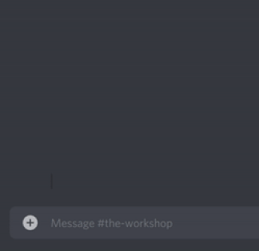

# Guild / Server Setup

[Back home](../index.md)

The `.mod` commands require some setup which can only be complete by the Server/Guild Owner. 

First, a Logging Room must be set. It's recommended to use a room which only your Moderators can see.
Get the room's ID , and send the command: ```.set_logs_room <room ID>```



When the logging room is set, you also need to set which roles in your server are allowed to use the `.mod_roles` command

| Command      | Additional Input | Output                 |
|--------------|------------------|------------------------|
| `.mod_roles` | `list`           | Lists Active Mod Roles |
| `.mod_roles` | `add` `"Role Name"` | Adds "Role Name" to Bot Mod Roles |
| `.mod_roles` | `remove` `"Role Name"` | Removes "Role Name" from Bot Mod Roles |
