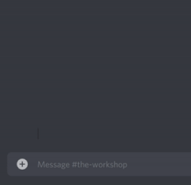

# .mod

[Back home](../index.md)

### Setup

The `.mod` commands require some setup which can only be complete by the Server/Guild Owner. 

First, a Logging Room must be set. It's recommended to use a room which only your Moderators can see.
Get the room's ID , and send the command: ```.set_logs_room <room ID>```

